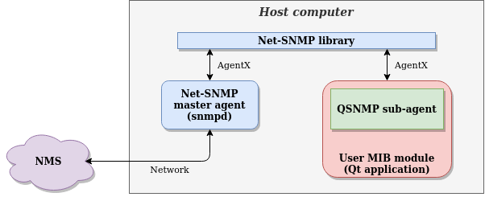

# qt-snmp-subagent
A simple Net-SNMP AgentX sub-agent interface for Qt (C++) applications that implement a MIB module.


## Detailed description

The qt-snmp-subagent (QSNMP) eases the implementation of a SNMP sub-agent in Qt-based C++ applications, in order to support your own MIBs. The whole source code is provided as a a single C++ header `QSNMP.h` and source `QSNMP.cpp` file, for easy integration directly within the application.<br>

In essence, QSNMP encapsulates the Net-SNMP library's sub-agent API for exchanging SNMP get, set and notifications messages with the SNMP master agent `snmpd`, using AgentX protocol. The Net-SNMP master agent (for which the configuration and documentation is out of scope of QSNMP) will handle actual transactions with the Network Management Station (NMS), including access control, notification forwarding, SNMP version translation, and more...



QSNMP is designed so that it requires very few lines of code to be useful. For common applications, you can expect a complete implementation that support SNMP GET/GETNEXT/SET/NOTIFICATIONS, dynamic scalar and/or tabular SNMP variables (OIDs), and logging, by using as little as 4 or 5 lines of code per OID. Moreover, the resulting code will be particularly relatable to your MIB file, so that you can focus more on handling the OID's actual (implementation-specific) data, rather than how to handle the MIB tree registration (QSNMP will do that for you).<br>

:point_right: An important note: QSNMP does not currently support multi-variable SET operations.


## Example application

An example usage of QSNMP is provided in the [example](example) directory.


## Installing the Net-SNMP software suite

The qt-snmp-subagent interface uses the Net-SNMP agent library API. In this regards, the Net-SNMP software suite needs to be installed on the host computer.
This section provides a short description on how to build and install the Net-SNMP suite from source code. The source code can be downloaded from the [Net-SNMP website](http://www.net-snmp.org/). I recommend downloading the latest version (`net-snmp-5.9.tar.gz` at the time of writing this notice), then extract the source code using the following terminal commands.
``` bash
tar -xzvf net-snmp-5.9.tar.gz
cd net-snmp-5.9
```

Then follow the instructions from the README and INSTALL files located in that folder. The installation instructions are also available on the Net-SNMP website [here](http://www.net-snmp.org/docs/INSTALL.html). A minimal install only needs those few commands to be executed:
``` bash
./configure
make
sudo make install
```

At this point, most SNMP applications (`snmpd`, `snmptrapd`, `snmpget`, `snmpset`, ...) and libraries (`libnetsmp`, `libnetsnmpagent`) should be installed on the system. Note that it may be necessary to execute the command `sudo ldconfig` for the linker to reference the newly installed Net-SNMP libraries.


## Integrate and build QSNMP into the user's application

Integrating QSNMP into your Qt project is straightforward, simply copy the `QSNMP.h` and `QSNMP.cpp` files into your project's directory, then edit your qmake `.pro` project file to link the Net-SNMP libraries and reference QSNMP files:
``` qmake
LIBS += -lnetsnmp -lnetsnmpagent
SOURCES += QSNMP.cpp 
HEADERS += QSNMP.h
```
Then in your source code, `#include QSNMP.h` wherever you need it.


## How to use QSNMP

QSNMP classes are designed to be simple and easy to use while offering sufficient flexibility for most sub-agent applications.

#### :point_right: Master and sub-agent communication

First and foremost, create an instance of the `QSNMPAgent` class. The `QSNMPAgent` will handle the communication between the Net-SNMP master agent and your application (the sub-agent), it will also handle the data type conversions between Net-SNMP and Qt. The constructor takes an `agentName` which is used by Net-SNMP to reference the sub-agent, and `agentAddr` which is an optional argument that sets the agent socket address (see -x option of `snmpd` application).

``` c++
QSNMPAgent::QSNMPAgent(const QString & agentName, const QString & agentAddr);
```


#### :point_right: Creating and registering variables

Most of the work is then relegated to subclassing the abstract class `QSNMPModule` in order to provide application-specific functionalities. It should be noted that nothing prevents you from providing multiple subclasses and instantiations of `QSNMPModule`, this is even the recommended way of operation as you can view a `QSNMPModule` as a collection of SNMP variables. I.e. a `QSNMPModule` is an object that contains one or multiple SNMP variables `QSNMPVar`. This is especially powerful and suitable for object-oriented-programming, and even more-so if your application needs to support dynamic object creation, deletion, as well as tables (each table entry can be seen as a `QSNMPModule`-derived item).

In your `QSNMPModule`-derived classes, you can create SNMP variables (either scalar or tabular), and automatically register them with the Net-SNMP master agent, using the `snmpCreateVar` method. This function takes a `name` argument which is useful mostly for logging and code comprehension (as SNMP does not really care about human-readable names, only OID). The data type (integer, string...) and maximum access level (read-only, read-write...) are set by the `type` and `maxAccess` arguments respectively. Finally, the complete variable OID is derived from a concatenation of `groupOid`, `fieldId` and `indexes` arguments.

``` c++
QSNMPVar * QSNMPModule::snmpCreateVar(const QString & name, QSNMPType_e type, QSNMPMaxAccess_e maxAccess,
                                      const QSNMPOid & groupOid, quint32 fieldId, const QSNMPOid & indexes);
```

Conversely, you can manually delete (and unregister from the Net-SNMP master agent) your variables using the `snmpDeleteVar` method. Note that the variables are also automatically deleted when you delete the parent `QSNMPModule` object.


#### :point_right: Getting and setting a variable's value

The Net-SNMP master will then need to actually get and set values for your variables. This is provided in your application code by implementing (via your subclass) the `snmpGetValue` and `snmpSetValue` pure virtual methods of `QSNMPModule` class. Those functions shall either return the value (from the user-application) or set the value (into the user-application) of the variable `var` passed in argument. Note that the variable's value is passed around QSNMP using a `QVariant`.

``` c++
QVariant snmpGetValue(const QSNMPVar * var) = 0;
bool snmpSetValue(const QSNMPVar * var, const QVariant & v) = 0;
```

To guarantee correct data-type conversions between QSNMP and Net-SNMP, the actual type of data stored in the `QVariant` must match the expected type of the SNMP variable, as shown in the `QSNMPType_e` enumeration:

``` c++
typedef enum
{
    QSNMPType_Integer = 0,  /* qint32 */
    QSNMPType_OctetStr,     /* QString */
    QSNMPType_BitStr,       /* QString */
    QSNMPType_Opaque,       /* QByteArray */
    QSNMPType_ObjectId,     /* QSNMPOid */
    QSNMPType_TimeTicks,    /* quint32 */
    QSNMPType_Gauge,        /* quint32 */
    QSNMPType_Counter,      /* quint32 */
    QSNMPType_IpAddress,    /* quint32 */
    QSNMPType_Counter64,    /* quint64 */
    QSNMPType_Null,
} QSNMPType_e;
```


#### :point_right: Generating traps (notifications)

QSNMP supports generating user-triggered traps to the Net-SNMP master agent. This is provided by calling the `sendTrap` method of `QSNMPAgent`. Here again, the `name` argument is only useful for logging, and the concatenation of `groupOid` with `fieldId` sets the OID of the SNMP trap to be generated. It is possible to add variable bindings (aka. payload) to the traps by setting the `var` or `varList` argument to valid (user-created) SNMP variables. QSNMP will take care of retrieving the variables' values by calling the appropriate `QSNMPModule::snmpGetValue` functions.

``` c++
void QSNMPAgent::sendTrap(const QString & name, const QSNMPOid & groupOid, quint32 fieldId, QSNMPVar * var);
void QSNMPAgent::sendTrap(const QString & name, const QSNMPOid & groupOid, quint32 fieldId, const QSNMPVarList & varList);
```


#### :point_right: Logging

QSNMP provides a simple logging mechanism, where log messages are emitted by the `QSNMPAgent` signal `newLog`. The `logType` enumeration indicates the source of the message and can thus be used to filter messages (i.e. it might be desirable to print out SET messages but filter out spammy GET messages).

``` c++
signals:
void newLog(QSNMPLogType_e logType, const QString & msg);
```

